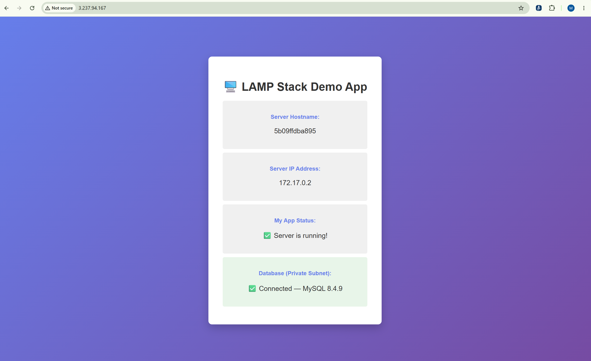

# AWS Infrastructure

## Create an Amazon RDS (MySQL) Database

In this section, you will create an Amazon RDS MySQL database that will be deployed in the private subnets created earlier.

### Step 1: Create a DB Subnet Group

A DB subnet group allows Amazon RDS to launch the database within your private subnets.

1. From the AWS Console, search for **Aurora and RDS**.
2. In the navigation pane, select **Subnet groups**.
3. Click **Create DB subnet group**.


### Step 2: Configure the subnet group using the following settings:

| Setting | Value |
|---------|-------|
| Name | Enter a name of your choice |
| Description | Enter a brief description |
| VPC | Select the VPC created earlier |
| Availability Zones | Select the Availability Zones where your private subnets reside |
| Subnets | Select both private subnets |

Click **Create**.

---

### Step 3: Create an RDS MySQL Database

1. From the RDS Console, select **Databases**.
2. Click **Create database**.
3. Choose **Full configuration**.


Configure the database using the following settings:

| Setting | Value |
|---------|-------|
| Engine type | MySQL |
| Database creation method | Full configuration |
| Template | Free Tier |
| Availability and durability | Single-AZ DB instance deployment |
| Engine version | Default or your preferred version |
| DB instance identifier | Enter a unique database identifier name |
| Master username | `admin` (or a username of your choice) |
| Credentials management | Self managed |
| Master password | Enter a secure password |
| Database authentication | Password authentication |
| Instance configuration | Leave the default settings |
| Storage | Leave the default settings |


Under the **Connectivity** section, configure the following:

| Setting | Value |
|---------|-------|
| Compute resource | Don't connect to an EC2 compute resource |
| VPC | Select the VPC created earlier |
| DB subnet group | Select the DB subnet group you created |
| Public access | **No** |
| VPC security group | Select the `mysql-rds-sg` security group |
| Availability Zone | us-east-1a |

Under the **Additional configuration** section

| Setting | Value |
|---------|-------|
| Initial database name | Enter a database name |
| Enable encryption | Uncheck |
| Backup | Uncheck |


Leave the remaining settings as their defaults and click **Create database**.

> **Note:** Creating the database may take several minutes. Once the database status changes to **Available**, copy the **Endpoint** from the **Connectivity & Security** tab. You will use this endpoint when deploying the Docker container on the EC2 instance.

---

## Launch an EC2 Instance (Web Server)

Launch an Ubuntu EC2 instance into one of the public subnets created earlier.

During the **Advanced Details** configuration, paste the following script into the **User data** field.

```bash
# Update package lists
sudo apt update

# Install Docker
sudo apt install -y docker.io

# Enable and start Docker
sudo systemctl enable docker
sudo systemctl start docker

# Add the ubuntu user to the Docker group
sudo usermod -aG docker ubuntu

# Verify Docker installation
docker --version

# Pull the Docker image
sudo docker pull yourdockerhubusername/python-web-app:latest

# Run the application
sudo docker run -d \
  --name python-web-app \
  --restart unless-stopped \
  -p 5000:5000 \
  -e DB_HOST=<RDS_ENDPOINT> \
  -e DB_PORT=3306 \
  -e DB_NAME=<DATABASE_NAME> \
  -e DB_USER=<DATABASE_USERNAME> \
  -e DB_PASSWORD=<DATABASE_PASSWORD> \
  -e FLASK_ENV=production \
  yourdockerhubusername/python-web-app:latest
```

After the instance has launched, connect to it using SSH and verify that the container is running.

```bash
docker ps
```

## Configure NGINX as a Reverse Proxy

Connect to the EC2 instance and install NGINX.

```bash
sudo apt update
sudo apt install -y nginx

sudo systemctl enable nginx
sudo systemctl start nginx
```

Verify that NGINX is running by visiting:

```text
http://<EC2_PUBLIC_IP>
```

You should see the default NGINX welcome page.

### Configure the Reverse Proxy

Create a new NGINX configuration file.

```bash
sudo vim /etc/nginx/sites-available/python-web-app
```

Paste the following configuration:

```nginx
server {
    listen 80;
    server_name _;

    location / {
        proxy_pass http://127.0.0.1:5000;

        proxy_set_header Host $host;
        proxy_set_header X-Real-IP $remote_addr;
        proxy_set_header X-Forwarded-For $proxy_add_x_forwarded_for;

        proxy_connect_timeout 60s;
        proxy_read_timeout 60s;
    }
}
```
Press **Esc** then :wq to save the file.


Enable the site and reload NGINX.

```bash
sudo ln -s /etc/nginx/sites-available/python-web-app /etc/nginx/sites-enabled/

sudo rm /etc/nginx/sites-enabled/default

sudo nginx -t

sudo systemctl reload nginx
```

---

## Test the Application

Open your browser and navigate to:

```text
http://<EC2_PUBLIC_IP>
```

If everything has been configured correctly, your Python web application should be running.



---

# Section 10: Clean Up AWS Resources

To avoid unnecessary AWS charges, delete the following resources after completing this tutorial:

- EC2 Instance
- Amazon RDS Database
- NAT Gateway
- Elastic IP
- Internet Gateway
- Route Tables
- Security Groups
- Subnets
- VPC

---

# Part 3: Automate the Deployment

In this section, you will automate the deployment process using **Terraform** to provision the AWS infrastructure and **GitHub Actions** to build, push, and deploy the Docker application.

## Section 11: Provision Infrastructure with Terraform

Create a `terraform` folder inside the root directory of your project and begin defining your infrastructure as code.