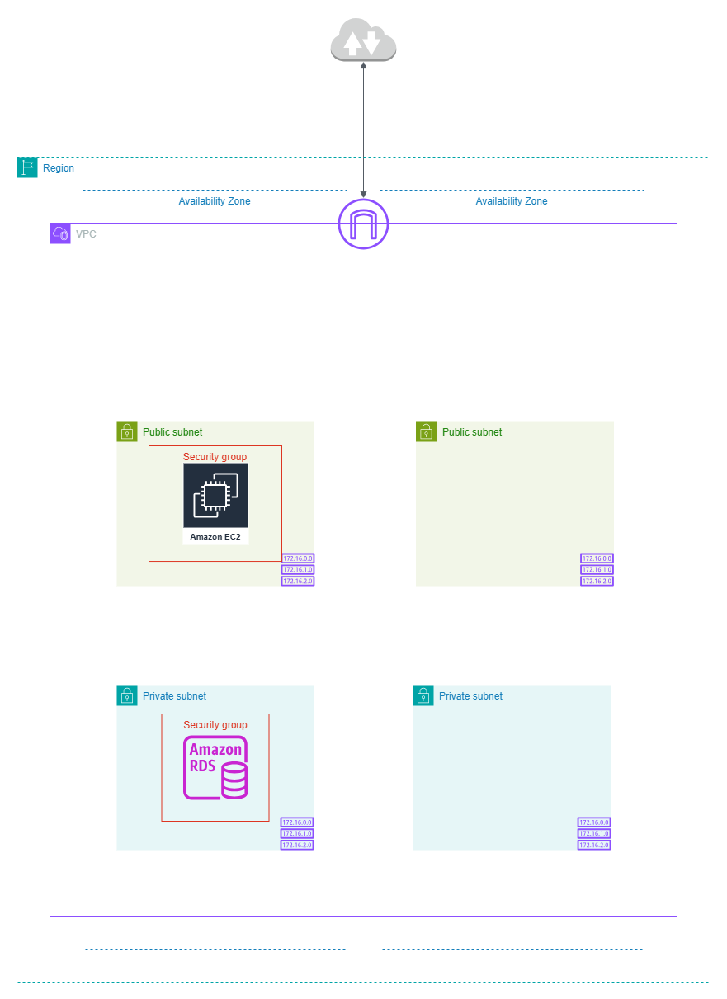

# Deploy A Simpe Python Web App with Nginx, MySQL on AWS Guide

## Prerequisites

- An AWS Account
- Docker Desktop
- Python installed
- AWS CLI (optional)

## Architecture Diagram 

# Table of Contents

| Section | Description |
|---------|-------------|
| 1 | [Run the Application Locally](section1_run_locally.md) |
| 2 | [AWS Infrastructure - Networking and setup](section2_networking_setup.md)|
| 3 | [AWS Infrastructure - Create the Amazon RDS (MySQL) Database & EC2 Web Server](Section3_aws_infrastructure.md) |
| 4 | Automate the Deployment with Terraform |
| 5 | Automate the Deployment with GitHub Actions |

