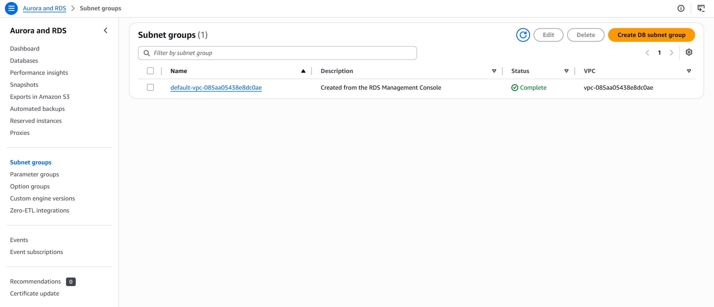
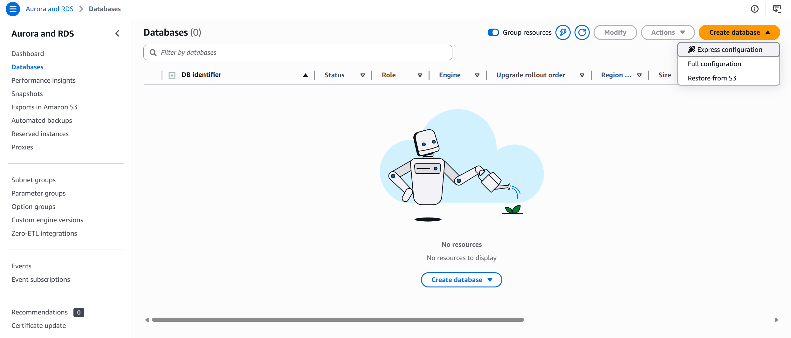

# Deploy A Simpe Python Web App with Nginx, MySQL on AWS Guide

## Prerequisites

- An AWS Account
- Docker Desktop
- Python installed
- AWS CLI (optional)

## Architecture Diagram 


# Table of Contents

| Section | Description |
|---------|-------------|
| 1 | Run the Application Locally |
| 2 | AWS Infrastructure - Networking and setup |
| 3 | AWS Infrastructure - Create the Amazon RDS (MySQL) Database & EC2 Web Server |
| 4 | Automate the Deployment with Terraform |
| 5 | Automate the Deployment with GitHub Actions |


### Section 3: Create an RDS (MySQL) Database


Create a DB Subnet group. 

From your AWS Console, search for `Aurora and RDS` Service. 

Select Subnet groups -> Create DB subnet group



Name: `Type a name of your choice`

Description: `Add a description`

VPC: `Select the VPC you created earlier`

Add Availability Zones: `Select the availability zones your subnets` reside

Subnets: `Select the two private subnets`

then click `Create` 


Select Database -> Create database -> Full configuration



Engine option: `MySQL`

Database Creation method: `Full configuration`

Template: `Free Tier`

This is selected by default if you are using a free account.

Availability and Durability: `Single-AZ DB instance deployment (1 instance)` 

This is also selected by default if you are using a free account.

Engine version: `Keep the default selection or choose your preferred version.`

DB instance identifier: `<type-an-instance-name> `

Master username: `admin` or `type a different username`

Credentials management: `Self managed`

Enter `Master password` and `Confirm master password`

Database authentication options: `Password authentication`

Instance configuration: `Keep the default configurations`

Storage: `Keep the default configurations`

Connectivity: `


### Section 4: Launch an EC2 Instance (Web Server)


Configure Docker in the user data with the following before launching the instance.

```
#!/bin/bash

# Update packages
sudo apt update

# Install Docker
sudo apt install -y docker.io

# Start Docker and enable it to start on reboot
sudo systemctl start docker
sudo systemctl enable docker

# Add your user to the docker group (so you don't need sudo every time)
sudo usermod -aG docker ubuntu

# Apply the group change (or log out and back in)
newgrp docker

# Confirm Docker is installed
docker --version

## Pull and run you app manually for testing purposes

sudo docker pull yourdockerhubusername/lamp-demo:latest

sudo docker run -d \
  --name lamp-app \
  --restart unless-stopped \
  -p 5000:5000 \
  -e DB_HOST=<your_db_public_host> eg: <your_db_identifer>.<unique_code>.<region>.rds.amazonaws.com \
  -e DB_PORT=3306 \
  -e DB_NAME=<YOUR_DB_NAME> \
  -e DB_USER=<YOUR_DB_USER> \
  -e DB_PASSWORD=<YOUR_USER_PASSWORD> \
  -e FLASK_ENV=<REPLACE_WITH_AN_ENVIRONMENT_OF_YOUR_CHOICE> \
  yourdockerhubusername/<docker_image_name>:<tag>

```
### Sectio 4: Set up NGINX on Web Server


```
sudo apt update
sudo apt install -y nginx

sudo systemctl start nginx
sudo systemctl enable nginx
sudo systemctl status nginx

Test the default Nginx webpage in your browser: visit http://<WEB_SERVER_PUBLIC_IP>

sudo vim /etc/nginx/sites-available/lamp-app

server {
    # Listen on port 80 (standard HTTP)
    listen 80;

    # Accept requests for any domain or IP
    server_name _;

    # Forward all requests to Flask running on port 5000
    location / {
        proxy_pass http://127.0.0.1:5000;

        # Pass the original request headers to Flask
        # so Flask knows the real client IP, not just 127.0.0.1
        proxy_set_header Host $host;
        proxy_set_header X-Real-IP $remote_addr;
        proxy_set_header X-Forwarded-For $proxy_add_x_forwarded_for;

        # Timeout settings
        proxy_connect_timeout 60s;
        proxy_read_timeout 60s;
    }
}

```

Create a symbolic link to enable this site

```
sudo ln -s /etc/nginx/sites-available/lamp-app /etc/nginx/sites-enabled/

# Remove the default site (so it doesn't conflict)
sudo rm /etc/nginx/sites-enabled/default

# Test the config for syntax errors
sudo nginx -t

# If you see: "syntax is ok" and "test is successful" then reload NGINX
sudo systemctl reload nginx
```

### Step 5: Test the app

Enter the web server IP address on your browser to see your app running:


### Step 6: Clean Up 

Delete all the resources created during this tutorial to avoid unnecessary charges: 

## Using Terraform and GitActions to deploy the docker app

In this section we will automate the deployment process by using Terraform to provision the infrastructure and GitHub Actions to automate the deployment.

### Step 1: Create a folder inside the root directory

